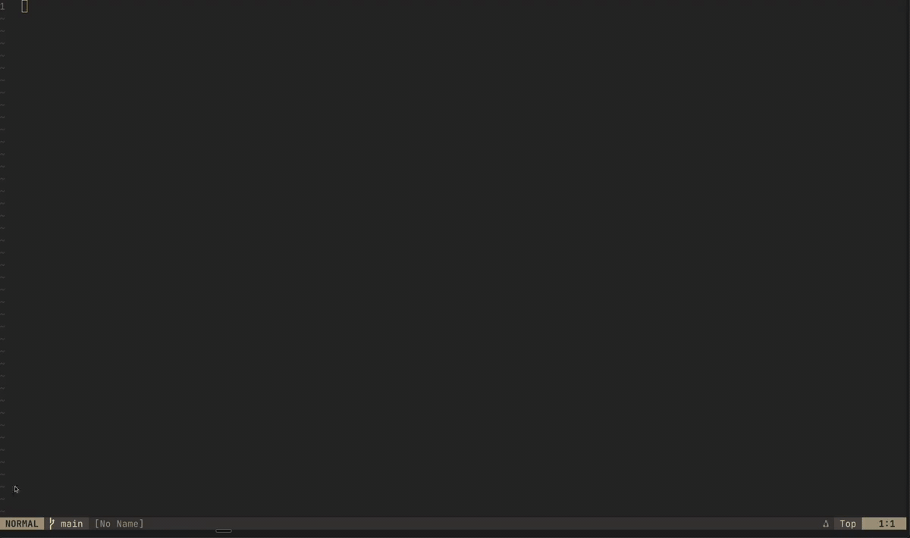

# summon.nvim

A Neovim plugin for launching terminal commands and opening files in persistent floating windows.



## Installation

### lazy.nvim

```lua
{
    "salkhalil/summon.nvim",
    opts = {},
}
```

## Configuration

Calling `setup()` with no arguments gives you a single floating terminal running `claude` on `<leader>c`.

```lua
require("summon").setup({
    -- Global defaults (apply to all commands unless overridden)
    width = 0.85,
    height = 0.85,
    border = "rounded",
    close_keymap = "<Esc><Esc>",
    highlights = {
        float = { bg = "#282828" },
        border = { fg = "#d79921", bg = "#282828" },
        title = { fg = "#282828", bg = "#d79921", bold = true },
    },
    -- Colors accept hex strings ("#282828") or integers (0x282828)
    terminal_passthrough_keys = { "<C-o>", "<C-i>" }, -- keys passed to terminal apps
    select_keymap = "<leader>s", -- keymap to open the command picker
    picker = "auto", -- "auto", "fzf", or "vim"

    -- Named commands
    commands = {
        claude = {
            type = "terminal", -- or "file" / "project_file"
            command = "claude",
            title = " Claude ",
            keymap = "<leader>c",
        },
        lazygit = {
            type = "terminal",
            command = "lazygit",
            title = " LazyGit ",
            keymap = "<leader>gg",
            height = 0.9, -- override global default
            border_color = "#89b4fa", -- custom border + title badge color
            terminal_passthrough_keys = {}, -- disable passthrough for lazygit
        },
        todos = {
            type = "file",
            command = "~/Documents/todos.md",
            title = " TODOs ",
            keymap = "<leader>t",
            filetype = "markdown", -- optional: override auto-detected filetype
        },
        project_notes = {
            type = "project_file",
            command = ".summon/notes.md", -- created relative to the nearest .git
            title = " Project Notes ",
            keymap = "<leader>pn",
            root_pattern = ".git", -- optional, defaults to .git
            filetype = "markdown",
        },
    },
})
```

### Global options

| Option                      | Description                                | Default                              |
|-----------------------------|--------------------------------------------|--------------------------------------|
| `width`                     | Default float width (0-1 ratio)            | `0.85`                               |
| `height`                    | Default float height (0-1 ratio)           | `0.85`                               |
| `border`                    | Default border style                       | `"rounded"`                          |
| `close_keymap`              | Default keymap to dismiss float            | `"<Esc><Esc>"`                       |
| `highlights`                | Custom highlight groups (hex strings or integers for colors) | `nil` (auto-detect from colorscheme) |
| `terminal_passthrough_keys` | Keys passed through to terminal apps       | `{ "<C-o>", "<C-i>" }`               |
| `select_keymap`             | Keymap to open the command picker           | `nil` (no binding)                   |
| `picker`                    | Picker backend: `"auto"`, `"fzf"`, or `"vim"` | `"auto"`                          |

### Command options

Each entry in `commands` supports:

| Option                      | Description                                     | Default                              |
|-----------------------------|-------------------------------------------------|--------------------------------------|
| `type`                      | Buffer type: `"terminal"`, `"file"`, or `"project_file"` | `"terminal"`                |
| `command`                   | Shell command (terminal), file path (file), or project-relative path (`project_file`) | (required) |
| `title`                     | Float window title                              | `" <name> "`                         |
| `keymap`                    | Normal mode keymap to open float                | `nil` (no binding)                   |
| `width`                     | Float width (0-1 ratio)                         | `0.85` (or global `width`)           |
| `height`                    | Float height (0-1 ratio)                        | `0.85` (or global `height`)          |
| `border`                    | Border style                                    | `"rounded"` (or global `border`)     |
| `close_keymap`              | Keymap to dismiss (mode depends on type)        | `"<Esc><Esc>"` (or global `close_keymap`) |
| `terminal_passthrough_keys` | Keys passed to terminal (terminal type only)    | (global `terminal_passthrough_keys`) |
| `border_color`              | Custom border and title badge color (hex string or integer) | `nil` (uses global highlight)        |
| `filetype`                  | Override filetype detection (file type only)    | `nil` (auto-detect)                  |
| `reload`                    | Destroy and re-run terminal on each open (terminal only) | `false`                     |
| `root_pattern`              | Project root marker for `project_file`          | `".git"`                             |

## Usage

### Keymaps

Keymaps defined in `commands` open the corresponding float directly. The default config binds `<leader>c` to open Claude.

### Commands

```vim
:Summon claude     " open a specific command by name
:Summon lazygit
:Summon            " open picker if multiple commands, or open directly if only one
```

`:Summon` supports tab completion for command names.

### Command Picker

When you have multiple commands configured, `:Summon` (with no arguments) opens a picker to choose one. You can also bind a key to open the picker directly:

```lua
require("summon").setup({
    select_keymap = "<leader>s",
    picker = "fzf", -- "auto" | "fzf" | "vim"
})
```

**Picker backends:**

| Value    | Description                                                     |
|----------|-----------------------------------------------------------------|
| `"auto"` | Uses [fzf-lua](https://github.com/ibhagwan/fzf-lua) if installed, otherwise falls back to `vim.ui.select` |
| `"fzf"`  | Use fzf-lua (requires [fzf-lua](https://github.com/ibhagwan/fzf-lua)) |
| `"vim"`  | Use Neovim's built-in `vim.ui.select`                           |

### Behaviour

**Terminal buffers:**
- Terminal buffers persist after closing the float — reopening reattaches to the same session.
- Each command gets its own independent buffer.
- Opens in insert mode automatically.
- Close the float with `<Esc><Esc>` (configurable) in terminal mode without killing the process.
- Configured keys in `terminal_passthrough_keys` are passed directly to the terminal application instead of being intercepted by Neovim (useful for TUI apps that need Ctrl+O, Ctrl+I, etc.).

**File buffers:**
- File buffers persist with any unsaved changes when the float is closed.
- Files are automatically created if they don't exist (with tilde expansion support).
- Opens in normal mode.
- Close the float with `q` or the configured `close_keymap` in normal mode.
- Neovim will prompt before closing if there are unsaved changes.

## Features

### Terminal Passthrough Keys

When using TUI applications in terminal buffers, Neovim intercepts certain key combinations (like `<C-o>` for jumplist navigation) before they reach the terminal. The `terminal_passthrough_keys` option allows you to specify which keys should be passed directly to the terminal application.

**Global configuration:**
```lua
require("summon").setup({
    terminal_passthrough_keys = { "<C-o>", "<C-i>", "<C-w>" }, -- all terminals get these keys
})
```

**Per-command override:**
```lua
require("summon").setup({
    terminal_passthrough_keys = { "<C-o>", "<C-i>" }, -- default for all terminals

    commands = {
        claude = {
            command = "claude",
            terminal_passthrough_keys = { "<C-o>", "<C-i>", "<C-w>" }, -- add Ctrl+W for claude
        },
        lazygit = {
            command = "lazygit",
            terminal_passthrough_keys = {}, -- disable passthrough for lazygit
        },
    },
})
```

### Reload Mode

By default, terminal buffers persist — closing the float keeps the process alive and reopening reattaches to the same session. For one-shot commands like test runners or build scripts, set `reload = true` to destroy the old buffer and re-run the command every time you open the float.

```lua
require("summon").setup({
    commands = {
        tests = {
            type = "terminal",
            command = "make test",
            reload = true,
            keymap = "<leader>t",
        },
    },
})
```

### Per-Command Border Colors

Give each command its own border color so you can tell windows apart at a glance. The title badge automatically uses the same color as the border background, keeping the appearance cohesive.

```lua
require("summon").setup({
    commands = {
        claude = {
            command = "claude",
            title = " Claude ",
            keymap = "<leader>c",
            border_color = "#e78a4e",
        },
        lazygit = {
            command = "lazygit",
            title = " LazyGit ",
            keymap = "<leader>gg",
            border_color = "#89b4fa",
        },
    },
})
```

Colors accept hex strings (`"#e78a4e"`) or integers (`0xe78a4e`). Commands without `border_color` use the global `highlights` setting (or the auto-detected colorscheme accent).

### File Buffers

Open files in floating windows with the same convenient interface as terminal commands. Perfect for quick notes, TODOs, or any file you want to access quickly.

**Basic file buffer:**
```lua
require("summon").setup({
    commands = {
        notes = {
            type = "file",
            command = "~/Documents/notes.txt",
            keymap = "<leader>n",
        },
    },
})
```

**With custom filetype:**
```lua
require("summon").setup({
    commands = {
        todos = {
            type = "file",
            command = "~/Documents/todos.md",
            title = " TODOs ",
            keymap = "<leader>t",
            filetype = "markdown", -- force markdown syntax highlighting
        },
    },
})
```

**Features:**

- Files are automatically created if they don't exist
- Tilde expansion works (`~/path/to/file`)
- Buffers persist with unsaved changes
- Auto-detected filetype (or override with `filetype` option)
- Opens in normal mode (use `q` to close)

### Project File Buffers

Open files relative to the nearest project marker instead of a fixed absolute path. This is useful for repo-local notes, scratch files, or metadata you want available in every project.

**Basic project file buffer:**
```lua
require("summon").setup({
    commands = {
        project_notes = {
            type = "project_file",
            command = ".summon/notes.md",
            keymap = "<leader>pn",
        },
    },
})
```

**With a custom root marker:**
```lua
require("summon").setup({
    commands = {
        package_notes = {
            type = "project_file",
            command = ".summon/package-notes.md",
            root_pattern = "package.json",
            keymap = "<leader>pp",
        },
    },
})
```

**How it works:**

- Root detection starts from the current buffer's directory when possible
- If the current buffer is not a normal file, Summon starts from `cwd`
- Summon searches upward for the nearest ancestor containing `root_pattern`
- If no marker is found, Summon falls back to `cwd`
- Parent directories are created automatically before the file is created
- `filetype`, `q`, and the configured `close_keymap` work the same as regular file buffers
